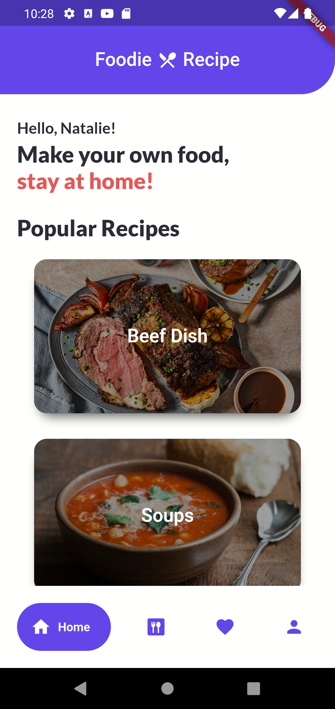
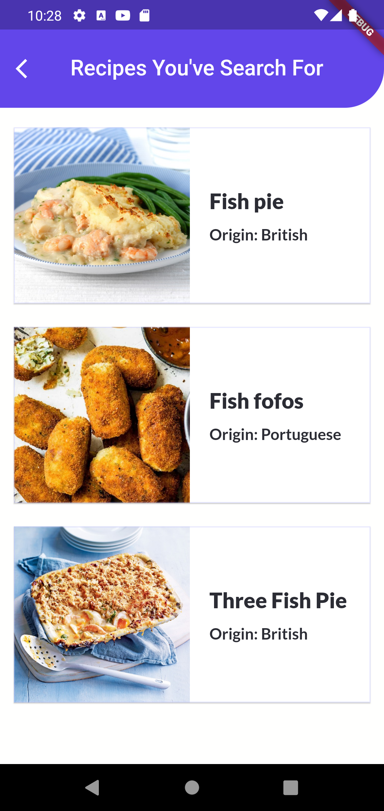
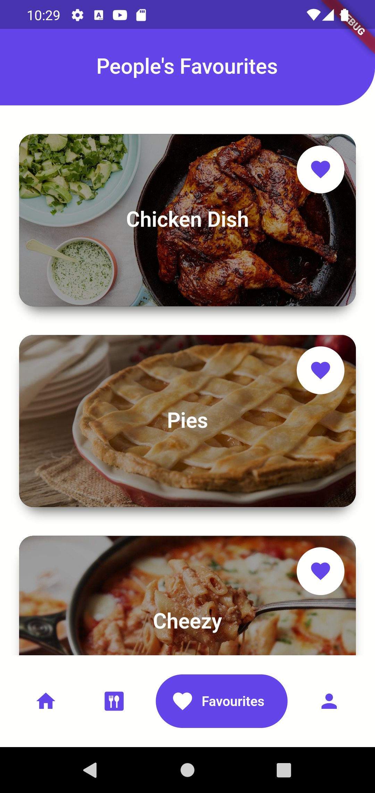
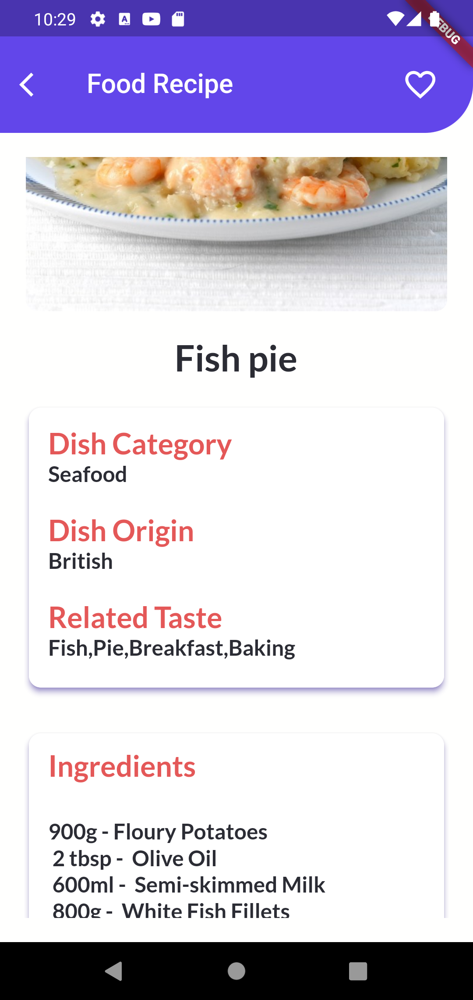
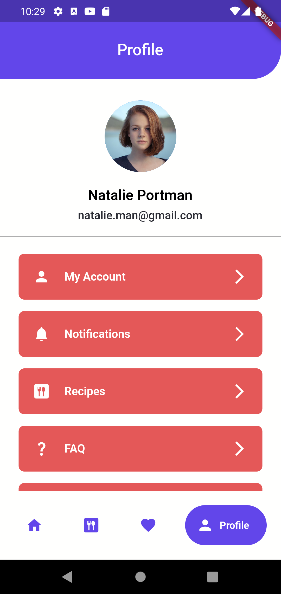

# recipe_app

Foodie Recipe is a cross-platform mobile application that allows users to look for food recipe to cook a delicious and healthy meal.

## Getting Started

This project is a starting point for a Flutter application.

A few resources to get you started if this is your first Flutter project:

- [Lab: Write your first Flutter app](https://docs.flutter.dev/get-started/codelab)
- [Cookbook: Useful Flutter samples](https://docs.flutter.dev/cookbook)

For help getting started with Flutter development, view the
[online documentation](https://docs.flutter.dev/), which offers tutorials,
samples, guidance on mobile development, and a full API reference.

https://user-images.githubusercontent.com/108638778/184321210-206ab52b-0a2a-4a31-bf90-78da6ac5e60d.mp4
